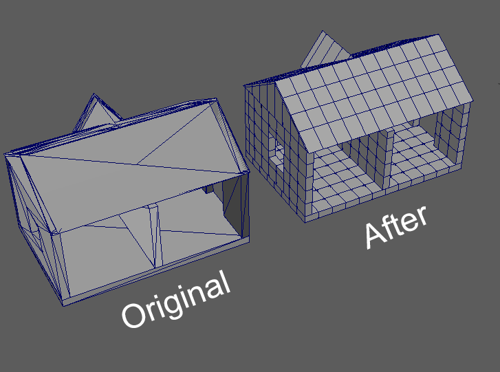
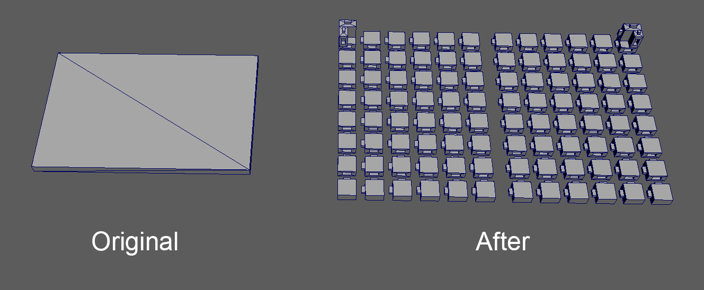
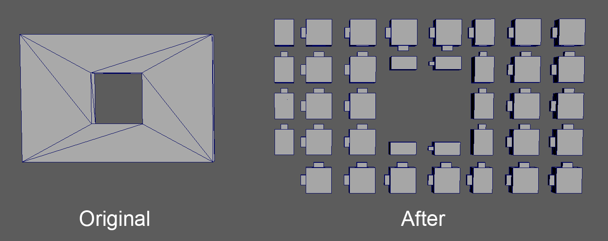

# 3DHouse-Interlocking
---
## Introduction
In 3D printing, the model size is been restricted to the 3D printer size. It can't print larger than the 3D printer. In this project, we will get the 3D models from the server.

## Example
* House

* Ground

* Wall with a single window

